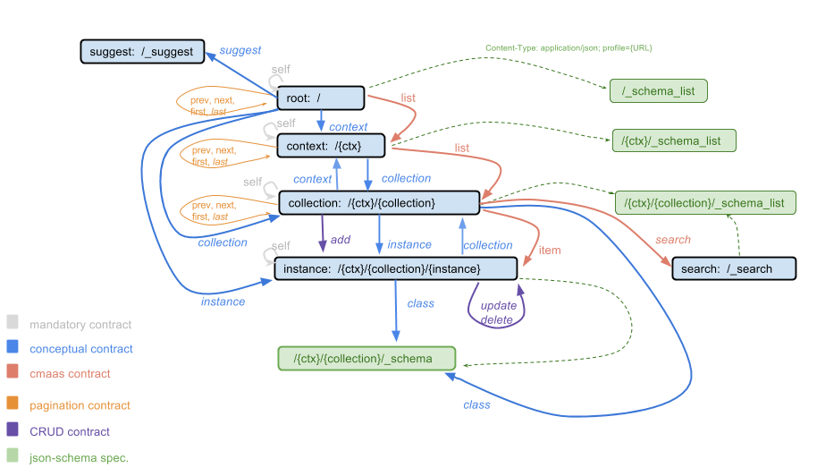

.. _links_spec:

Hypermap of Resources
----------------------

The image below depicts the map of hypermedia resources supported by Brainiak API.



.. the image source is https://docs.google.com/a/corp.globo.com/drawings/d/1qmmk31PFlyrl-GVminwuAatT6ofr5IvykyfjlVwjb-4/edit?usp=sharing

Links Specification
-------------------

In our API, successful responses have a ``links`` section that state possible actions for the resource being retrieved
or access to other resources.
For more about this concept, see :doc:`../concepts` and :doc:`../concepts/hypermedia`.

For example:

.. highlight:: json

::

  {
    "links": [
      {
        "href": "http://api.semantica.dev.globoi.com/person/Gender/Male",
        "rel": "self"
      },
      {
        href: "http://api.semantica.dev.globoi.com/person/Gender",
        method: "GET",
        rel: "inCollection"
      },
      {
        "href": "http://api.semantica.dev.globoi.com/person/Gender/Male",
        "method": "PUT",
        "schema": {"$ref": "http://api.semantica.dev.globoi.com/person/Gender/_schema"}
        "rel": "update"
      },
      {
        "href": "http://api.semantica.dev.globoi.com/person/Gender/Male",
        "method": "DELETE",
        "rel": "delete"
      }
    ]
  }


The URLs in ``href`` can be exact URLs or templates described by `URI template`_.
When they are templates, each placeholder variable of the template should have the respective variable
defined in each entry of the ``items`` section.
For example:

.. highlight:: json

::

  { "items": [
      {
        "title": "Europa",
        "instance_prefix": "http://semantica.globo.com/place/Continent/",
        "@id": "http://semantica.globo.com/place/Continent/Europe",
        "resource_id": "Europe"
      }
    ],
    "links": [
      {
        "href": "http://api.semantica.dev.globoi.com/place/Continent/{resource_id}?instance_prefix={instance_prefix}",
        "method": "GET",
        "rel": "item"
      }
    ]
  }


.. _`URI template`: http://tools.ietf.org/html/rfc6570


Rel Vocabulary
---------------

In the description below we use the term ``target`` to designate the resource retrieved that owns the link relations.
Unless specified otherwise, GET is the default HTTP method used in each of the link relations.

Defined by the ``rel`` key, the possible link relations are grouped in logically related links.
We call this groups ``contracts``.


-----


Mandatory contract
``````````````````

The ``mandatory contract`` is a group of links that need to be present in every response.


self
........

The target resource URL itself, i.e. a URL to the target resource that owns the links.


-----


CRUD contract
`````````````

The ``CRUD contract`` is a group of links that represent the four basic data manipulation operations.


create
..........

Refers to a resource that can be used to create other resources of the same type as the target.


edit
........

Refers to a resource that can be used to edit incrementally the target.

Method: PATCH


update
...........

Refers to a resource that can be used to edit the target by entirely redefining its content.
When using ``update``, the target will be removed and inserted again.

Method: PUT

More about the `difference between HTTP PUT and PATCH`_.

.. _`difference between HTTP PUT and PATCH`: http://tools.ietf.org/html/rfc5789


delete
..........

Delete the target.

Method: DELETE


describedBy
...............

Refers to a resource providing information about the target's type in json-schema notation.


-----

Conceptual contract
```````````````````

The ``Conceptual contract`` is a group of links that represent the specific concepts provided by the Brainiak API.

root
....

The ``root`` link refers to the starting point of hypernavigation in the Brainiak API.
The current implementation has chosen to represent a list of contexts in the ``root``.


context
................

The ``context`` link refers to some context.
This concept is explained in :ref:`concept-context`.
Each context is a namespace that holds a list of collections.

collection
................

The ``collection`` link refers to some collection.
This concept is explained in :ref:`concept-collection`.
The collection is a list of instances that share the same type.

instance
................

The ``instance`` link refers to the properties and values of an instance.
This concept is explained in :ref:`concept-instance`.


class
................

The ``class`` link refers to the type of an instance, defining its properties.
This concept is explained in :ref:`concept-schema`.


-----

CMAaS contract
```````````````````

The ``CMAaS contract`` is a group of links that adhere to the Globo.com generic CMAaS or ``Content Management Application as a Service``.


item
........

When the target is a list, the ``item`` refers to each resource within that list.
Moreover, these items are guaranteed *not* to be lists.

instances
.............

When the target is a list, the ``instances`` refers to each resource within that list that represents a sub-list.
Moreover, these resources are guaranteed to be also lists.


-----

Pagination contract
```````````````````````

The ``Pagination contract`` is a group of links that support the basic primitives to navigate through items organized in pages.


first
.........

Refers to the first page of a list.


last
........

Refers to the last page of a list.
This link is only present if the respective resource URL receives the ``do_item_count`` parameter set to 1.


previous
............

Refers to the previous page in a list.


next
........

Refers to the next page in a list.

.. warning::

   By default, the ``item_count`` attribute of a list is not computed.
   As a result, the URL given by the ``next`` link may not contain data beyond the last page.


